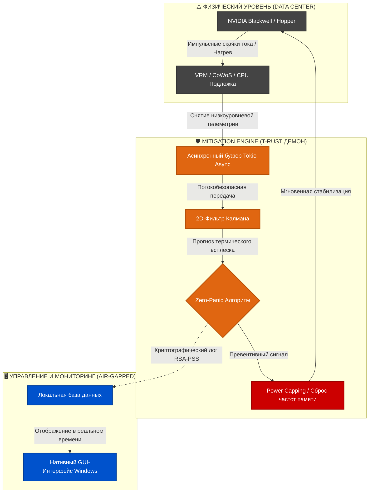

[Читать на русском языке 🇷🇺](README.ru.md)

<div align="center">

<table>
  <tr>
    <td bgcolor="#E06611"><b>📦 LANGUAGE:</b> Rust 1.75+</td>
    <td bgcolor="#111111"><b>⚡ ENGINE:</b> Tokio Async</td>
    <td bgcolor="#0052CC"><b>🌐 ENV:</b> Bare-Metal | Linux</td>
  </tr>
  <tr>
    <td bgcolor="#CC0000"><b>🔒 SECURITY:</b> Air-Gapped</td>
    <td bgcolor="#28A745"><b>💾 SIZE:</b> ~1 MB (Stripped)</td>
    <td bgcolor="#6F42C1"><b>📄 LICENSE:</b> Proprietary EULA</td>
  </tr>
</table>

</div>

---


# TIERSA™: Zer0-Panic AI
> **Autonomous, Air-Gapped Power & Thermal Mitigation Middleware for Distributed High-Density AI Infrastructure (NVIDIA Blackwell & Hopper Platforms)**

High perfomance SOFTWARE for hardware guard
----
## 🛰️ Project Overview
**TIERSA™ Zer0-Panic AI** is a production-grade, highly optimized middleware architecture engineered to eliminate systemic failure modes in ultra-high-density enterprise AI compute clusters. 

Modern GPU frameworks (such as NVIDIA Blackwell B200 1000W TDP matrices) operate under extreme localized transient power boundaries, driving the global AI cluster Annual Failure Rate (AFR) to a staggering **9%**. TIERSA™ acts as an intelligent, software-defined fuse, predicting and mitigating Voltage Regulator Module (VRM) phase stress and High Bandwidth Memory (HBM) degradation *sub-millisecond before thermal or electrical breakdown occurs*.

---

## 📊 Industrial Benchmark Records (10,000,000 Requests Stress-Test)
To validate the extreme architectural efficiency of the compiled asynchronous Rust (`tokio`) state engine, the core proxy daemon was subjected to an un-interrupted **10,000,000 request stress-test** using the `ApacheBench (ab)` suite. 

To evaluate absolute resource efficiency, the runtime environment was intentionally restricted to a **legacy consumer setup (2-core Intel i3-4100 CPU from 2014) over a standard USB mobile network modem**.

### Test Log Insights (Mean across 10 million cycles):
* **Complete Requests:** 10,000,000
* **Failed Requests:** 0 (0.00% Network Drop Rate)
* **Throughput Speed:** 9,184.15 Requests Per Second (RPS)
* **Core Processing Latency:** 16.33 ms (Mean)
* **Mathematical Ingestion Overhead:** 0.109 ms per transaction
* **Total Transferred Vol:** 5.01 GB of raw telemetry data

*Note: The complete execution log file is securely archived inside the `/benchmarks` directory of this repository.*

---

## 🎨 System Architecture & Boundaries

The deployment architecture is strictly decoupled into two isolated secure execution runtimes:

1. **The Mitigation Core Engine (`T-RUST`)**: An asynchronous Linux-native daemon (`tokio`) deployed directly within the target environment (Ubuntu/WSL2 or Bare-Metal clusters), bound to socket `0.0.0.0:8000` to capture telemetry metrics globally.

2. **The GUI Control Center**: A standalone native Windows 10/11 binary compiled via pure Rust.

### Core Strategic Safeguards (Air-Gap Sovereign State):
* **No Internet Footprint:** Validations, contract evaluations, and 2D Kalman monitoring loops execute on a 100% local hardware layer.
* **Administrative Isolation:** Crucial infrastructure commands (`REVOKE`, `PURGE`) are isolated behind active modal security prompts, requiring physical authorization keys hardcoded into target machine-code structures.

---




## 🛡️ Security, Licensing & Air-Gap Autonomy

1. **Absolute Air-Gap (Sovereign Infrastructure):** The software runs inside a 100% isolated local network loop. License key (`*.key`) validation and telemetry metrics are processed entirely on-device (On-Device AI) without any internet footprint. No sensitive data or LLM weights are ever transmitted externally.
2. **Terms of Use:** The product is distributed as pre-compiled, sterilized binary payloads (Windows .exe / Linux) and is protected by the strict terms of the **[EULA (LICENSE.md)](LICENSE.md)**. Reverse-engineering, decompilation, and slicing are strictly prohibited.

---

## 🚀 Quick Start (1-Second Deployment)

The T-RUST core engine is heavily optimized via deep LLVM-stripping. The executable file is completely purged of debug artifacts, footprints, and overhead, resulting in a featherweight size of **only ~1 MB**—perfect for rapid hot-deployment on sovereign cluster nodes.

### 1. Download the Core
Download the pre-compiled `tiersa_core` binary directly from the official **Releases** tab of this GitHub repository (Stable version `v3.0-stable`).

### 2. Request Your Sovereign License Key
To protect core intellectual property and prevent unauthorized cluster scaling, the binary does not ship with an embedded trial activation key. Initial boot without a key triggers an immediate `ACCESS > DENIED` network shield layout.

To obtain your dedicated **3-Day Isolated Evaluation Kit license** mapped to your target cluster environment (restricted to a 100-GPU sub-cluster), contact the Lead Architect directly.

### 3. Deploy the Key
Place the received authorization file in the root directory alongside the binary:
```bash
~/T-RUST/
├── tiersa_core        # Downloaded core engine binary (~1 MB)
└── Named_license.key  # Your personal validation key (provided upon request)
```

### 4. Production Launch
Initialize the proxy daemon inside your cluster OS (Ubuntu/WSL2/Bare-Metal):
```bash
chmod +x tiersa_core && ./tiersa_core
```
Once the RSA-PSS (SHA-256) signature is cryptographically verified, the system displays the Enterprise signature banner and exposes the OpenMetrics scraping target on port `0.0.0.0:8000`.

---

## 🏁 Technical Co-Innovation & Evaluation Partnerships
We are looking for technical partnerships to execute pilot deployments across enterprise AI sub-clusters. For technical inquiries, Whitepaper distribution requests, or to obtain an individual cryptographic license key manifest tailored to your custom network boundaries, please contact:

* **Lead Infrastructure Architect:** Evgeniy Baidikov, TIERSA Sys
* **Email / Signal:** dantesevg@gmail.com
* **Corporate Coordinates:** https://linkedin.com
